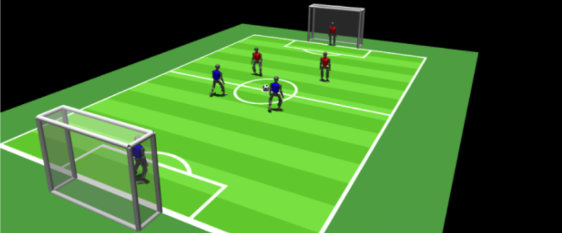

# Entrega 1 — Conhecendo o projeto, o usuário e o problema

**Data:** 12/08/2026

**Status:** 🟩 CONCLUÍDA

**Responsabilidade:** 1 solução consolidada por equipe

Equipe nº 27
## Objetivo da atividade

Reinterpretar o tema do TCC sob a perspectiva de Interação Humano-Computador e construir um **entendimento comum entre os integrantes da equipe**.

A disciplina utiliza preferencialmente o tema do TCC para os exercícios de IHC. Isso vale tanto para TCCs que já preveem uma interface quanto para trabalhos cujo resultado principal é algoritmo, modelo, API, biblioteca, análise de dados, infraestrutura, estudo experimental ou outro artefato técnico.

> **Importante:** a interface projetada na disciplina é um artefato de aprendizagem de IHC. Ela **não se torna automaticamente uma obrigação do TCC**. Sua incorporação ao trabalho de conclusão depende de decisão da equipe e do orientador.

Antes de preencher, leia [`../GUIA_ESCOPO_IHC.md`](../GUIA_ESCOPO_IHC.md).

Nesta primeira semana a equipe **não deve começar desenhando telas**. Primeiro deverá compreender:

- o que o TCC realmente produz;
- quem poderia obter valor dessa contribuição;
- quais pessoas interagem, administram, configuram, interpretam ou são afetadas;
- o que essas pessoas precisam alcançar;
- como atividades relacionadas acontecem hoje;
- problemas, limitações e contexto;
- alternativas existentes;
- qual recorte de interação fará sentido para a disciplina.

Ao final desta entrega, a equipe deve diferenciar:

- **tema do TCC** × **escopo formal do TCC** × **escopo de IHC da disciplina**;
- **objetivo do projeto** × **objetivo do usuário**;
- **problema do usuário** × **solução tecnológica**;
- **fato conhecido** × **hipótese** × **lacuna de conhecimento**;
- **capacidade técnica** × **forma de uso dessa capacidade**;
- **funcionalidade** × **atividade/resultado que o usuário precisa alcançar**;
- **usuário direto** × **stakeholders**.

---

## Como classificar as respostas

Sempre que a resposta fizer uma afirmação sobre usuários, problemas, atividades, necessidades, contexto ou mercado, use:

- **[F] Fato conhecido** — existe evidência/fonte.
- **[H] Hipótese** — afirmação plausível que ainda precisa ser investigada.
- **[?] Não sabemos ainda** — lacuna relevante.

Quando usar `[F]`, informe a origem. Hipóteses prioritárias devem receber IDs (`H01`, `H02`...) e também ser registradas em [`../RASTREABILIDADE.md`](../RASTREABILIDADE.md).

> **Exemplo:** `[H] H01 — DBAs considerariam útil comparar automaticamente o plano atual de execução com uma recomendação produzida pelo algoritmo.`

Uma hipótese explicitada é melhor do que uma suposição escondida.

---

# 0. Identificação do TCC e da equipe

## 0.1 Membros

| Nome completo | Matrícula | GitHub |

| Rafaela Altheman de Campos | 22.125.062-4 | RafaAltheman |

| Manuella Filipe Peres | 24.224.039-3 | manu3lla |

| Letizia Lowatzki Baptistella | 22.125.063-2 | le-bap |

## 0.2 Título atual do TCC

**Aprendizado por reforço profundo para locomoção bípede de um robô humanoide em simulação**

## 0.3 Orientador(a)

Orientador: Isaac Jesus

Coorientador: Reinaldo Bianchi

## 0.4 Qual é o resultado principal atualmente previsto no TCC?

Marque e descreva:

- [ ] sistema/aplicação interativa;
- [ ] algoritmo;
- [X] modelo de IA/ML/LLM;
- [ ] biblioteca/API/framework;
- [ ] análise de dataset;
- [ ] estudo/benchmark/avaliação experimental;
- [ ] infraestrutura/backend;
- [ ] componente embarcado/IoT;
- [ ] outro: {{...}}.

**Descrição:** Modelo de aprendizado por reforço profundo responsável por aprender uma política de controle para a locomoção bípede do robô humanoide Atom, buscando uma caminhada estável e eficiente em ambiente simulado da RoboCup 3D.

## 0.5 O TCC já previa desenvolvimento de interface com usuário?

- [ ] Sim, a interface já faz parte do TCC.
- [ ] Parcialmente; existe alguma interação, mas ainda não está bem definida.
- [X] Não. O TCC é predominantemente técnico e não previa interface.

**Explique o que está formalmente previsto no TCC:** O TCC prevê a modelagem do robô humanoide Atom e sua integração à plataforma de simulação MuJoCo, onde serão realizados o treinamento e a avaliação do modelo de aprendizado por reforço profundo. A interação ocorre com o ambiente de simulação para configurar, executar e analisar os experimentos, mas não está previsto o desenvolvimento de uma interface específica voltada ao usuário.

> Esta resposta serve para separar o compromisso do TCC do projeto da disciplina. Mesmo quando a opção for **não**, a equipe irá definir uma interface para exercitar IHC.

---

# 1. Entendendo a contribuição do projeto

## 1.1 Explique o TCC em uma frase, sem citar linguagem de programação, framework ou banco de dados.

O TCC busca desenvolver uma estratégia de locomoção bípede estável e eficiente para o robô humanoide Atom por meio de aprendizado por reforço profundo em ambiente simulado.

## 1.2 Qual situação, atividade ou problema do mundo real motivou o TCC?

[F] A motivação surgiu a partir da experiência das integrantes em competições de robótica, principalmente no Brasil, onde foi possível observar a dificuldade das equipes em desenvolver um walking estável e eficiente. Problemas na locomoção, como quedas e baixa velocidade, acabam prejudicando diretamente o desempenho do robô durante as partidas.

Origem: experiência das integrantes da equipe em competições de robótica e literatura utilizada no TCC sobre o impacto da locomoção no desempenho competitivo.

Fonte: MacAlpine e Stone (2018), referência [19] do TCC — https://link.springer.com/chapter/10.1007/978-3-030-00308-1_39

## 1.3 Qual é a **capacidade/contribuição central** produzida pelo TCC?

[F] Nosso TCC busca melhorar a forma como o robô humanoide Atom caminha, usando aprendizado por reforço profundo para que ele aprenda uma política de controle capaz de manter o equilíbrio, se deslocar com mais estabilidade e velocidade e lidar melhor com situações inesperadas durante a simulação. A ideia é que esse walking contribua para um desempenho melhor do robô nas partidas.

Origem: objetivo e metodologia do próprio TCC.

## 1.4 O que se espera que esteja diferente **para pessoas, organizações ou processos** se essa contribuição for bem-sucedida?

[H] Se a proposta funcionar bem, ela pode contribuir não só para a RoboFEI, mas também servir como referência para outras equipes de futebol de robôs humanoides que enfrentam dificuldades parecidas com locomoção. O estudo pode ajudar no desenvolvimento de walkings mais estáveis e eficientes e mostrar como o aprendizado por reforço profundo pode ser aplicado nesse tipo de problema.

## 1.5 O que é mérito técnico/científico do TCC e o que seria uma possível aplicação prática?

| Mérito/contribuição técnica | Possível aplicação/valor em uso |

| Mérito/contribuição técnica                                                                                                  | Possível aplicação/valor em uso                                                     |
| ---------------------------------------------------------------------------------------------------------------------------- | ----------------------------------------------------------------------------------- |
| Desenvolvimento e avaliação de uma política de controle com aprendizado por reforço profundo para a locomoção bípede do Atom | Melhorar o walking do Atom e contribuir para uma locomoção mais estável e eficiente |
| Avaliação por diferentes métricas de desempenho                                                                              | Permitir uma análise mais completa da qualidade da locomoção                        |
| Estudo do DRL como alternativa aos métodos tradicionais de controle                                                          | Servir como referência para outras equipes e pesquisas de robótica humanoide        |

---

# 2. Entendendo as pessoas envolvidas

## 2.1 Quem interage diretamente com o produto, se já existe interface prevista?

NÃO SE APLICA AO ESCOPO ORIGINAL

[F] O TCC não prevê uma interface própria para usuário. A interação atual acontece diretamente com o ambiente de simulação já existente (MuJoCo).

## 2.2 Quem poderia **usar, configurar, administrar, operar, interpretar ou tomar decisões** a partir da contribuição técnica?

Considere perfis profissionais e stakeholders, não apenas consumidores finais.

| Perfil | Relação com a contribuição | O que faria | Status/evidência |

| Perfil                                                | Relação com a contribuição                                                       | O que faria                                                             | Status/evidência |
| ----------------------------------------------------- | -------------------------------------------------------------------------------- | ----------------------------------------------------------------------- | ---------------- |
| Pesquisadores e estudantes de robótica                | Poderiam utilizar o estudo como referência ou base para novos experimentos       | Comparariam métodos, parâmetros e resultados de locomoção               | [H]              |
| Integrantes de equipes de futebol de robôs humanoides | Poderiam aplicar os aprendizados do estudo em problemas semelhantes de locomoção | Analisariam resultados e avaliariam a qualidade do walking              | [H]              |
| Desenvolvedores responsáveis pelo robô                | Poderiam integrar ou adaptar a política de locomoção ao restante do sistema      | Avaliariam configurações e a integração da locomoção com outras funções | [H]              |

## 2.3 Existem pessoas afetadas que não usariam a interface diretamente?

| Stakeholder | Como é afetado | Usa interface? | Status/evidência |

| Stakeholder                                   | Como é afetado                                                                                                                                          | Usa interface?      | Status/evidência              |
| --------------------------------------------- | ------------------------------------------------------------------------------------------------------------------------------------------------------- | ------------------- | ----------------------------- |
| Demais integrantes da equipe RoboFEI          | Podem ser beneficiados caso melhorias na locomoção contribuam para o desempenho do robô nas competições                                                 | não | [H]                           |
| Professores e orientadores                    | Acompanham o desenvolvimento e podem utilizar os resultados para orientar decisões técnicas e trabalhos futuros                                         | não | [F] — participação no projeto |
| Outras equipes de futebol de robôs humanoides | Podem utilizar os resultados e aprendizados do trabalho como referência para seus próprios projetos                                                     | não | [H]                           |
| Pesquisadores da área de robótica humanoide   | Podem utilizar os resultados como referência para comparação e continuidade de pesquisas                                                                | não                 | [H]                           |
| Narradores e comentaristas das competições    | Podem se beneficiar de informações sobre desempenho, evolução e comportamento dos robôs para contextualizar melhor as partidas                          | não                 | [H]                           |
| Fabricantes de componentes e robôs humanoides | Podem se beneficiar de análises sobre desempenho e limitações dos robôs para compreender necessidades técnicas das equipes                              | não                 | [H]                           |
| Público que acompanha as competições          | Pode ser afetado indiretamente pela qualidade e competitividade das partidas, principalmente quando os robôs apresentam maior estabilidade e eficiência | não                 | [H]                           |
| Espectadores e ouvintes das transmissões      | Podem compreender melhor o desempenho e a evolução dos robôs caso essas informações sejam apresentadas durante ou após as competições                   | não                 | [H]                           |

## 2.4 Que características desses perfis podem influenciar a interação?

Considere conhecimento do domínio, experiência tecnológica, frequência de uso, necessidades de acessibilidade, responsabilidade profissional, familiaridade com métricas, linguagem técnica, urgência etc.

[H] Os principais usuários provavelmente terão conhecimento técnico em robótica e familiaridade com métricas de desempenho, embora o nível de experiência possa variar entre estudantes, desenvolvedores e pesquisadores.

[F] O TCC utiliza diferentes métricas para avaliar a locomoção, como distância percorrida, velocidade média, altura do centro de massa e taxa de quedas, já que a recompensa isolada não é suficiente para avaliar o comportamento do agente.
Origem: metodologia do TCC.

[H] Organizar essas informações de forma visual e comparável pode facilitar a interpretação dos resultados.

---

# 3. Entendendo objetivos e atividades

## 3.1 O que o usuário está tentando conseguir no mundo real?

Não responda “usar o algoritmo”, “clicar no sistema” ou “ver o dashboard”.

[F] O usuário busca conseguir uma locomoção mais estável, eficiente e competitiva para o robô humanoide, reduzindo quedas e melhorando sua capacidade de se deslocar e se recuperar durante situações de jogo.

Origem: objetivo e contexto competitivo apresentados no TCC.

## 3.2 Quais são as atividades mais importantes?

| ID | Atividade/objetivo | Quem realiza | Frequência/criticidade inicial | Status/evidência |

| ID  | Atividade/objetivo                                                        | Quem realiza                      | Frequência/criticidade inicial | Status/evidência         |
| --- | ------------------------------------------------------------------------- | --------------------------------- | ------------------------------ | ------------------------ |
| A01 | Configurar e iniciar treinamentos do agente                               | Integrantes da equipe de robótica | Frequente / alta               | [F] — metodologia do TCC |
| A02 | Acompanhar e interpretar métricas de desempenho do treinamento            | Integrantes da equipe             | Frequente / alta               | [F] — metodologia do TCC |
| A03 | Comparar resultados dos treinamentos e avaliar o comportamento do walking | Integrantes da equipe             | Frequente / alta               | [F] — metodologia do TCC |

## 3.3 Qual atividade parece mais frequente? Por quê?

[F] A atividade que parece mais frequente é acompanhar os treinamentos e analisar seus resultados, porque o desenvolvimento envolve vários ciclos de treinamento, avaliação e ajuste de parâmetros até chegar a um comportamento bom para o robô.

Origem: processo de treinamento e avaliação descrito no TCC.

## 3.4 Qual parece mais crítica? Que consequência existe se for mal executada?

[F] A atividade mais crítica é interpretar corretamente os resultados do treinamento e decidir quais ajustes devem ser feitos. Uma interpretação errada pode levar a equipe a manter parâmetros ou uma função de recompensa inadequados, fazendo o agente aprender comportamentos que parecem bons pelas métricas, mas que não representam uma caminhada eficiente. O próprio TCC destaca que apenas a recompensa não é suficiente para avaliar o comportamento do agente.

Origem: metodologia e métricas de avaliação do TCC.

---

# 4. Entendendo o problema ou processo atual

## 4.1 Como essas atividades são realizadas hoje, antes da interface imaginada na disciplina?

Pode existir software concorrente, linha de comando, planilha, notebook, script, painel técnico, processo manual, consulta a logs, análise visual, troca de mensagens, decisão por especialista etc.

[F] No contexto atual do nosso TCC, o treinamento e a avaliação são feitos diretamente no ambiente de simulação MuJoCo. Nós configuramos os experimentos, executamos o treinamento do agente, acompanhamos as métricas como recompensa, velocidade, distância percorrida e taxa de quedas, além de observar visualmente o comportamento do robô no simulador. Os resultados dos diferentes ciclos de treinamento precisam ser registrados e analisados.

Origem: metodologia e experimentos do TCC.

[?] Ainda não sabemos exatamente como outras equipes de robótica organizam e comparam os resultados de seus testes e treinamentos.

## 4.2 O que é difícil, demorado, confuso, repetitivo, arriscado ou pouco transparente?

[F] O processo exige vários ciclos de treinamento, análise e ajuste de parâmetros, o que pode ser demorado e repetitivo. Além disso, não é suficiente analisar apenas a recompensa do agente, já que ela pode aumentar mesmo quando o comportamento aprendido não representa um bom walking. Por isso, é necessário analisar várias métricas e também observar o robô visualmente.

[H] Comparar diferentes treinamentos e entender quais mudanças realmente melhoraram o desempenho pode ser difícil quando as informações estão distribuídas entre métricas, execuções e observações visuais.

## 4.3 Que informações o profissional precisa interpretar para tomar decisão?

[F] O profissional precisa interpretar informações como:

-recompensa obtida durante o treinamento
-distância percorrida
-velocidade média
-taxa de quedas
-estabilidade e equilíbrio do robô
-comportamento visual do walking
-configurações e parâmetros utilizados em cada treinamento

Essas informações ajudam a decidir se o treinamento está evoluindo e quais ajustes devem ser feitos para os próximos experimentos

Origem: metodologia e métricas de avaliação do TCC.

## 4.4 O que acontece quando a atividade falha ou quando o resultado é interpretado incorretamente?

[F] Uma interpretação incorreta pode fazer a equipe considerar um treinamento como bom mesmo quando o agente aprendeu um comportamento inadequado. Por exemplo, o agente pode aumentar sua recompensa mantendo-se parado e equilibrado, sem realmente aprender a caminhar de forma eficiente. Também podem ser feitos ajustes inadequados nos parâmetros ou na função de recompensa, comprometendo os treinamentos seguintes.

Origem: metodologia e avaliação de resultados gerados no TCC.

## 4.5 Conte uma situação concreta.

Escreva uma pequena narrativa com pessoa, objetivo, atividade, contexto, dificuldade e consequência. **Não descreva ainda a futura solução.**

[H] Uma integrante da equipe roda um treinamento para tentar melhorar o walking do robô. No final, percebe que a recompensa aumentou e inicialmente o resultado parece bom. Porém, ao analisar outras métricas, observa que o robô está mais equilibrado, mas quase não se desloca. Nesse caso, olhar apenas para a recompensa poderia levar a uma interpretação errada do treinamento.

## 4.6 Que evidência existe hoje?

| Evidência/fonte | O que sustenta | Limitação |

| Evidência/fonte                                         | O que sustenta                                                                          | Limitação                                                     |
| ------------------------------------------------------- | --------------------------------------------------------------------------------------- | ------------------------------------------------------------- |
| Experimentos preliminares realizados no TCC             | Mostram que configurações e treinamentos precisam ser acompanhados e avaliados          | Representam principalmente o processo da própria equipe       |
| Metodologia e literatura utilizada no TCC               | Sustentam a necessidade de analisar várias métricas e não apenas recompensa             | Não mostram como outras equipes organizam essa análise        |
| Experiência das integrantes com a RoboFEI e competições | Sustenta a dificuldade prática relacionada ao desenvolvimento de um walking competitivo | A experiência não representa necessariamente todas as equipes |

---

# 5. Entendendo o contexto de uso

## 5.1 Onde e em quais situações a interação poderia ocorrer?

[H] A interação poderia ocorrer principalmente em laboratórios de robótica e durante períodos de desenvolvimento, testes e preparação para competições. A análise dos resultados também pode acontecer após testes ou partidas, quando a equipe precisa decidir quais ajustes serão feitos.

## 5.2 Em quais dispositivos/equipamentos?

[H] Principalmente em computadores ou notebooks utilizados para executar o ambiente de simulação, realizar os treinamentos e analisar os resultados.

## 5.3 Existem condições físicas relevantes?

Considere iluminação, ruído, mobilidade, conexão, privacidade, uso compartilhado, interrupções, pressão de tempo etc.

[H] Não foram identificadas condições físicas muito específicas para o uso. Como a interação deve ocorrer principalmente em computadores, podem existir interrupções e pressão de tempo durante períodos de testes ou preparação para competições.

## 5.4 Existem fatores sociais ou organizacionais?

Considere papéis, chefias, equipes, permissões, aprovação, responsabilidade profissional, auditoria, turnos e colaboração.

[H] Sim. O desenvolvimento acontece dentro de uma equipe de robótica, então diferentes integrantes podem participar da configuração dos experimentos, análise dos resultados e tomada de decisões.

[F] Também existe acompanhamento de professores e orientadores, que participam das decisões técnicas do projeto.

## 5.5 Existe necessidade de histórico, rastreabilidade ou auditoria?

[F] No TCC existe necessidade de registrar configurações e resultados dos experimentos para permitir comparação e reprodutibilidade.
Origem: metodologia do TCC.

[H] Para a futura interface, manter um histórico de testes e resultados pode ser importante para acompanhar a evolução da locomoção ao longo do tempo.

## 5.6 Um erro pode produzir consequência relevante? Qual?

[F] Sim. Uma configuração inadequada ou uma interpretação errada dos resultados pode fazer o agente aprender um comportamento ruim, comprometer a convergência do treinamento e gerar perda de tempo computacional. Em alguns casos, uma escolha inadequada das observações fornecidas ao agente pode comprometer o aprendizado mesmo que o algoritmo esteja correto.

Origem: metodologia e discussão do TCC.

---

# 6. Entendendo mercado e alternativas existentes

> Nesta entrega faça apenas um **levantamento inicial**. A análise aprofundada ocorre na Entrega 2.

## 6.1 Como pessoas resolvem problemas semelhantes hoje?

| Alternativa atual | Quem usa | Para quê | Status/evidência |

| Alternativa atual                                                | Quem usa                                      | Para quê                                                                            | Status/evidência                      |
| ---------------------------------------------------------------- | --------------------------------------------- | ----------------------------------------------------------------------------------- | ------------------------------------- |
| Controladores tradicionais de locomoção baseados em ZMP          | Equipes e pesquisadores de robótica humanoide | Gerar e controlar padrões de caminhada por meio de modelos de equilíbrio            | [F] — literatura do TCC               |
| Técnicas de aprendizado por reforço profundo                     | Pesquisadores e equipes de robótica           | Aprender políticas de locomoção em ambiente simulado                                | [F] — literatura do TCC               |
| Simulação e avaliação por métricas e observação do comportamento | Pesquisadores e equipes de robótica           | Testar, avaliar e comparar a qualidade da locomoção antes de situações competitivas | [F] — metodologia e literatura do TCC |

## 6.2 Existem produtos que atuam na mesma área, mesmo sem serem equivalentes ao TCC?

[F] Sim. Existem diferentes plataformas e ambientes de simulação utilizados em robótica e aprendizado por reforço. No próprio TCC, por exemplo, são considerados MuJoCo e PyBullet como ambientes possíveis para simulação de robôs, embora o MuJoCo tenha sido escolhido pela maior fidelidade na modelagem.

Também existem ambientes ligados à RoboCup 3D, utilizados por diferentes equipes para testar e comparar comportamentos de robôs humanoides. 
Esse é um exemplo do simulador da RoboCup 3D com robôs do Bahia-RT

## 6.3 Quais interfaces profissionais esse público já conhece?

Exemplos possíveis: ferramentas de banco, IDEs, consoles de nuvem, dashboards, plataformas de dados, ferramentas de monitoramento, painéis de IA, sistemas administrativos.

[H] Esse público provavelmente já está acostumado com:

- ambientes de simulação de robótica
- IDEs e ferramentas de desenvolvimento
- gráficos de treinamento
- ferramentas para acompanhamento de métricas
- visualização 3D do comportamento do robô

## 6.4 O que essas soluções parecem fazer bem?

[F] Os simuladores permitem executar muitos experimentos sem depender diretamente do robô físico e possibilitam observar o comportamento do agente em diferentes situações. No caso do MuJoCo, o nosso TCC destaca principalmente a boa simulação de contatos e articulações e sua eficiência para treinamentos com muitos passos

[H] Ferramentas de gráficos e métricas também podem facilitar o acompanhamento da evolução do treinamento

Fonte: Todorov, Erez e Tassa (2012), referência [31] do TCC — MuJoCo: A Physics Engine for Model-Based Control.

URL: https://ieeexplore.ieee.org/document/6386109/

## 6.5 O que parecem fazer mal, dificultar ou não atender?

[H] As ferramentas atuais podem exigir que o usuário consulte separadamente parâmetros, métricas e comportamento visual do robô, dificultando uma comparação rápida entre diferentes treinamentos.

## 6.6 Que padrões de interface ou vocabulário parecem familiares a esse público?

[H] Por ser um público mais técnico, alguns termos e padrões provavelmente são familiares, como:

- episódio
- recompensa
- agente
- treinamento
- política
- hiperparâmetros
- velocidade
- distância percorrida
- taxa de quedas
- gráficos de evolução
- comparação entre execuções
- visualização da simulação

---

# 7. Derivando o escopo de IHC da disciplina

## 7.1 Escolha o caminho do projeto

### Caminho A — TCC já possui interface

Explique qual parte da interface será usada como recorte da disciplina e por que esse fluxo é relevante.

Não possui interface, vamos seguir o caminho B.

### Caminho B — TCC não possui interface prevista

Faça o exercício de transferência de uso:

> **Imagine que o TCC foi concluído com sucesso e uma empresa, laboratório ou organização quer transformar a contribuição em algo utilizável. Quem precisaria interagir com ela e para quê?**

Responda:

1. quem poderia contratar/adotar a solução? 

Equipes de robótica, laboratórios de pesquisa, universidades e organizações que desenvolvem robôs humanoides.

2. quem seria o usuário direto? 

Integrantes de equipes de robótica, pesquisadores e desenvolvedores responsáveis por acompanhar o desempenho dos robôs.

3. quem administraria/configuraria? 

Integrantes técnicos da equipe, responsáveis por cadastrar robôs, inserir resultados de testes e configurar métricas de comparação.

4. quem interpretaria resultados? {{...}}

Desenvolvedores, pesquisadores, professores e responsáveis técnicos pela evolução do robô.

5. quem tomaria decisões? {{...}}

A própria equipe de desenvolvimento, que utilizaria os resultados para decidir quais aspectos do robô precisam ser melhorados e evoluir na caminhada do robô

6. quais dados/entradas seriam necessários? 

Dados de desempenho do robô, como velocidade, estabilidade, número de quedas, distância percorrida, tempo de recuperação e resultados de diferentes testes ou competições.

7. quais resultados deveriam ser compreendidos? 

O desempenho geral do robô, seus pontos fortes e fracos, evolução ao longo do tempo e comparação com outros robôs ou versões anteriores.

8. que erros/rupturas seriam possíveis? 

Inserção de dados incorretos, comparação entre testes realizados em condições diferentes, interpretação errada das métricas ou ausência de informações importantes para avaliar o desempenho.

## 7.2 Qual perfil será priorizado no projeto de IHC?

Integrante de uma equipe de robótica humanoide responsável por analisar e melhorar o desempenho do robô.

**Por que esse perfil foi escolhido?** 

Porque esse usuário participa diretamente do processo de desenvolvimento e precisa interpretar diferentes informações sobre o comportamento e o desempenho do robô ao longo de testes, treinamentos e competições. Isso pode envolver métricas como velocidade, estabilidade, quedas, desempenho em partidas, evolução entre versões e resultados de diferentes execuções. A partir dessas informações, ele precisa identificar pontos fortes, limitações e possíveis melhorias, além de comparar resultados para apoiar decisões da equipe. A interface pode ajudar a reunir e organizar esses dados, facilitando a análise do desempenho e o acompanhamento da evolução do robô ao longo do tempo.

## 7.3 Qual objetivo desse usuário será priorizado?

Entender o desempenho do robô humanoide, identificar seus principais pontos de melhoria e acompanhar sua evolução ao longo dos testes, além de coletar estatísticas dele durante as partidas.

## 7.4 Que interface será explorada na disciplina?

Complete:

> **Para fins da disciplina de IHC, será projetada uma interface que permita a `{{perfil}}` utilizar `{{capacidade/resultado do TCC}}` para `{{objetivo}}`, no contexto de `{{situação}}`.**

Para fins da disciplina de IHC, será projetada uma interface voltada principalmente a integrantes de equipes de robótica humanoide, permitindo acompanhar, visualizar e comparar o desempenho dos robôs em testes, treinamentos e competições. A proposta é reunir em um só lugar métricas, resultados e informações de diferentes execuções, facilitando a identificação de pontos fortes, limitações, falhas e possíveis melhorias ao longo do desenvolvimento.

A interface também poderá ajudar a acompanhar a evolução do robô entre diferentes versões, testes e partidas, permitindo que a equipe use essas informações para orientar decisões sobre ajustes e próximos passos. Em contextos de competição, parte dessas informações também pode ser útil para outros públicos, como narradores, comentaristas e pessoas que acompanham as transmissões, ajudando a contextualizar melhor o desempenho e a evolução dos robôs durante as partidas.

## 7.5 Qual é a relação dessa interface com o TCC?

- [ ] Já fazia parte do TCC.
- [ ] É um aprofundamento de algo parcialmente previsto.
- [X] É uma extensão conceitual criada para a disciplina.
- [X] É um protótipo demonstrativo de aplicação potencial.
- [ ] Outra: {{...}}.

> **Declaração:** a interface desenvolvida nesta disciplina é um artefato de aprendizagem de IHC baseado no tema do TCC. Sua inclusão ou implementação no TCC somente ocorrerá se isso for posteriormente decidido pela equipe e pelo orientador.

A interface não faz parte do escopo formal do TCC. Ela utiliza o contexto de robótica humanoide e avaliação de desempenho como ponto de partida, mas amplia o foco para permitir que equipes acompanhem, comparem e interpretem o desempenho de seus robôs de forma mais geral.

# 8. Levantando possibilidades de interação — sem desenhar ainda

A equipe pode registrar possibilidades para investigação. **Não significa que todas serão implementadas.**

Marque apenas as que parecem plausíveis e explique o objetivo correspondente.

| Possibilidade | Pode fazer sentido? | Objetivo/tarefa que justificaria | Evidência atual |

| Possibilidade                       | Pode fazer sentido? | Objetivo/tarefa que justificaria                                                                                        | Evidência atual |
| ----------------------------------- | ------------------- | ----------------------------------------------------------------------------------------------------------------------- | --------------- |
| Dashboard/visão geral               | Sim                 | Ter uma visão rápida do desempenho geral do robô e das principais métricas                                              | [H]             |
| Configuração/parametrização         | Talvez              | Permitir escolher quais métricas, robôs, testes ou competições serão analisados                                         | [H]             |
| Entrada/upload/seleção de dados     | Sim                 | Inserir ou selecionar resultados de testes, treinamentos e competições para análise                                     | [H]             |
| Acompanhamento de processamento     | Talvez              | Acompanhar o carregamento e o processamento de novos resultados                                                         | [H]             |
| Relatório/resultados                | Sim                 | Visualizar os resultados de forma organizada e apoiar a tomada de decisão                                               | [H]             |
| Histórico com busca/filtros         | Sim                 | Consultar resultados anteriores e localizar informações por robô, data, competição ou tipo de teste                     | [H]             |
| Comparação de resultados            | Sim                 | Comparar diferentes robôs, versões, testes ou execuções e identificar onde houve melhora ou piora                       | [H]             |
| Explicabilidade/detalhamento        | Sim                 | Entender melhor as métricas, os resultados e os pontos fortes e fracos do robô                                          | [H]             |
| Administração/configurações globais | Não                 | Neste momento, não foi identificada uma necessidade clara para esse tipo de administração                               | [?]             |
| Usuários/perfis/permissões          | Talvez              | Pode ser útil caso diferentes integrantes ou públicos tenham responsabilidades e níveis de acesso distintos             | [?]             |
| CRUD de entidade do domínio         | Talvez              | Permitir cadastrar e atualizar robôs, equipes, testes ou competições, caso isso seja necessário para organizar os dados | [H]             |
| Auditoria/logs                      | Não                 | Neste momento, não foi identificada uma necessidade clara de auditoria ou registro detalhado das alterações             | [?]             |
| Alertas/ocorrências                 | Talvez              | Destacar quedas de desempenho, resultados fora do esperado ou acontecimentos importantes durante testes e competições   | [H]             |
| Ajuda/documentação                  | Sim                 | Explicar métricas, informações da interface e facilitar o uso por pessoas com diferentes níveis de conhecimento técnico | [H]             |

> **Atenção:** “login + dashboard + CRUD” não é uma solução universal. Cada padrão deve surgir de uma tarefa real.

---

# 9. Benefícios e ações iniciais

## 9.1 Qual benefício concreto o projeto de IHC pretende oferecer?

| Benefício esperado | Problema/necessidade | Usuário | Status/evidência |

| Benefício esperado                                    | Problema/necessidade                                                                                                                | Usuário                                            | Status/evidência |
| ----------------------------------------------------- | ----------------------------------------------------------------------------------------------------------------------------------- | -------------------------------------------------- | ---------------- |
| Facilitar a análise do desempenho do robô             | As informações de desempenho podem estar espalhadas entre diferentes métricas, testes e observações                                 | Integrantes de equipes de robótica humanoide       | [H]              |
| Facilitar a comparação entre testes e versões do robô | Pode ser difícil perceber rapidamente se uma mudança realmente melhorou ou piorou o desempenho                                      | Integrantes de equipes de robótica humanoide       | [H]              |
| Ajudar a identificar pontos de melhoria               | A equipe precisa entender em quais aspectos o robô apresenta melhor ou pior desempenho                                              | Integrantes de equipes de robótica humanoide       | [H]              |
| Acompanhar a evolução do robô ao longo do tempo       | As informações obtidas durante testes e partidas podem não ficar organizadas de forma que facilite a análise e comparação posterior | Integrantes de equipes de robótica e pesquisadores | [H]              |

## 9.2 Que ações o usuário deverá conseguir realizar?

| ID | O usuário precisa conseguir... | Para alcançar... | Prioridade inicial |

| F01 | Visualizar as principais métricas de desempenho do robô | Entender rapidamente como o robô está se saindo | alta |

| F02 | Comparar resultados entre diferentes testes, robôs ou versões | Identificar melhorias e pioras no desempenho | alta |

| F03 | Consultar o histórico de testes e resultados | Acompanhar a evolução do robô ao longo do tempo | alta |

| F04 | Filtrar resultados por robô, teste, período ou competição | Encontrar informações específicas com mais facilidade | média |

| F05 | Visualizar detalhes dos testes | Entender melhor os pontos fortes e fracos do desempenho | média |

| F06 | Inserir ou selecionar novos dados de desempenho | Manter as análises atualizadas com novos testes | média |

## 9.3 Tecnologias/restrições já definidas no TCC

A tecnologia aparece **agora**, depois do entendimento do uso.

| Tecnologia/restrição                                          | Por que existe                                                                                     | Possível impacto na interação                                                                          |
| ------------------------------------------------------------- | -------------------------------------------------------------------------------------------------- | ------------------------------------------------------------------------------------------------------ |
| MuJoCo                                                        | É o simulador utilizado para modelar e executar os experimentos de locomoção                       | A interface pode precisar trabalhar com dados e resultados gerados nesse ambiente                      |
| RoboCup 3D                                                    | É o ambiente de competição utilizado para avaliar o comportamento do robô                          | Os resultados analisados podem estar relacionados a partidas e testes realizados nesse ambiente        |
| Aprendizado por Reforço Profundo                              | É a abordagem utilizada para treinar a política de locomoção do robô                               | A interação pode envolver métricas específicas de treinamento, como recompensa, episódios e desempenho |
| Modelo do robô em formato compatível com o MuJoCo             | O robô precisa estar representado no simulador para que os experimentos possam ser executados      | Pode limitar quais robôs conseguem ser utilizados diretamente no mesmo fluxo                           |
| Necessidade de hardware com capacidade computacional adequada | Os treinamentos podem exigir grande quantidade de processamento                                    | Pode afetar o tempo de execução dos experimentos e a disponibilidade dos resultados                    |
| Execução em Linux                                             | O ambiente e as ferramentas utilizadas no projeto foram configurados para esse sistema operacional | Limita a execução dos treinamentos e experimentos a máquinas compatíveis com Linux                     |

---

# 10. Hipóteses e dúvidas prioritárias

| ID  | Hipótese/dúvida                                                                                                                                                     | Por que importa                                                   | Como poderá ser investigada |
| --- | ------------------------------------------------------------------------------------------------------------------------------------------------------------------- | ----------------------------------------------------------------- | --------------------------- |
| H01 | Integrantes de equipes de robótica têm dificuldade em reunir e comparar diferentes métricas e informações de desempenho dos robôs ao longo de testes e competições. | É o principal problema que justificaria a criação da plataforma.  | Entregas 3, 4 e 7           |
| H02 | Centralizar e comparar resultados de diferentes testes, versões ou robôs ajudaria as equipes a identificar melhorias, pioras e limitações de desempenho.            | Sustenta uma das principais propostas de interação da plataforma. | Entregas 5, 6 e 7           |
| H03 | Os usuários possuem familiaridade suficiente com métricas e vocabulário técnico de robótica para utilizar uma interface de análise de desempenho.                   | Influencia a linguagem e o nível de detalhamento da interface.    | Entregas 3 e 7              |

Registre em [`../RASTREABILIDADE.md`](../RASTREABILIDADE.md).

---

# 11. Síntese da equipe

| Pergunta                               | Síntese atual                                                                                                                                                                                                          |
| -------------------------------------- | ---------------------------------------------------------------------------------------------------------------------------------------------------------------------------------------------------------------------- |
| Qual é a contribuição central do TCC?  | Desenvolver e avaliar uma política de controle baseada em aprendizado por reforço profundo para melhorar a locomoção bípede do robô humanoide Atom.                                                                    |
| O TCC já previa interface?             | Não. O TCC é predominantemente técnico e utiliza ferramentas e ambientes de simulação já existentes.                                                                                                                   |
| Quem é o usuário prioritário de IHC?   | Integrantes de equipes de robótica humanoide responsáveis por acompanhar, analisar e contribuir para a melhoria do desempenho dos robôs.                                                                               |
| O que ele precisa alcançar?            | Entender o desempenho do robô, identificar pontos fortes, limitações e oportunidades de melhoria e acompanhar sua evolução ao longo do tempo.                                                                          |
| Qual problema/atividade será estudado? | A análise, organização e comparação de métricas e resultados de desempenho obtidos em testes, treinamentos e competições.                                                                                              |
| Como isso acontece hoje?               | No contexto do TCC, os resultados são avaliados por métricas e observação do comportamento do robô. Ainda será investigado como outras equipes organizam e comparam informações de desempenho em diferentes situações. |
| Qual é o contexto de uso?              | Equipes e laboratórios de robótica durante desenvolvimento, testes, treinamentos e competições.                                                                                                                        |
| Que interface/recorte será explorado?  | Uma plataforma para visualizar, acompanhar e comparar métricas e resultados de desempenho de robôs humanoides.                                                                                                         |
| Como a interface se relaciona ao TCC?  | É uma extensão conceitual que parte do contexto de locomoção e avaliação de desempenho estudado no TCC e amplia esse uso para uma análise mais geral do desempenho de robôs humanoides.                                |
| Quais pontos ainda são hipóteses?      | H01 — dificuldade em reunir e comparar informações; H02 — valor da centralização e comparação; H03 — familiaridade técnica dos usuários.                                                                               |

### Delimitação

**Dentro do escopo de IHC:** Projetar e avaliar uma interface que permita visualizar métricas, consultar históricos, comparar resultados e identificar pontos de melhoria no desempenho de robôs humanoides.

**Fora do escopo de IHC:** Desenvolver ou modificar algoritmos de locomoção, controlar diretamente o robô, criar um novo simulador ou implementar o sistema completo de coleta automática dos dados.

**Dentro do escopo formal do TCC:** Modelagem do Atom, treinamento de uma política de locomoção utilizando aprendizado por reforço profundo e avaliação do desempenho do robô em ambiente simulado.

**Interface da disciplina será implementada no TCC?** não definido — Não definido — a interface é uma extensão conceitual criada para a disciplina de IHC e sua implementação no TCC não está prevista atualmente.

---

# 12. Como esta entrega alimenta as próximas

- **Entrega 2:** verifica mercado, concorrentes e interfaces profissionais representativas.
- **Entrega 3:** detalha perfis e contexto.
- **Entrega 4:** aprofunda situações problemáticas.
- **Entrega 5:** modela tarefas centrais.
- **Entrega 6:** experimenta alternativas em baixa fidelidade.
- **Entrega 7:** investiga hipóteses com dados.
- **Entrega 8:** define restrições e metas de usabilidade.
- **Entregas 9–11:** transformam o recorte em modelo de interação e protótipo.
- **Entregas 12–14:** avaliam a interface construída na disciplina.

A Entrega 1 é uma **fotografia inicial do conhecimento**. Ela pode e deve ser revisada quando surgirem evidências.

---

# 13. Relação com INOVA e comunicação do projeto

Prepare uma explicação de até três frases:

1. **Problema/atividade humana:** Equipes de robótica precisam acompanhar e comparar diferentes informações para entender o desempenho de locomoção de seus robôs e identificar o que pode ser melhorado.

2. **Contribuição técnica do TCC:** O TCC busca desenvolver uma política de controle baseada em aprendizado por reforço profundo para melhorar a locomoção bípede do robô humanoide Atom.

3. **Como uma pessoa poderia utilizar essa contribuição:** Uma equipe poderia acompanhar e comparar os resultados de desempenho do robô para identificar pontos fortes, limitações e orientar decisões sobre seu desenvolvimento, para competir ou melhorar os estudos acadêmicos sobre isso.

Essa síntese ajuda a apresentar o projeto para público não especializado sem reduzir seu mérito técnico.

---

# Checklist de qualidade

- [X] Está clara a diferença entre tema do TCC, escopo formal do TCC e escopo de IHC.
- [X] A equipe declarou se o TCC já previa interface.
- [X] Se não previa, foi derivado um usuário plausível e um objetivo de uso.
- [X] A interface de IHC não foi apresentada como obrigação automática do TCC.
- [X] A contribuição do TCC foi descrita sem começar por tecnologias de implementação.
- [X] Usuários diretos e stakeholders foram diferenciados.
- [X] Foram considerados profissionais que configuram, administram, interpretam ou decidem, quando pertinente.
- [X] Objetivo do usuário não foi confundido com objetivo do projeto.
- [X] Processo/problema atual foi descrito antes da solução.
- [X] Existe situação concreta de uso/problema.
- [X] Contexto físico, social/organizacional, dispositivos e consequências de erro foram considerados.
- [X] Mercado/alternativas existentes foram levantados inicialmente.
- [X] Possibilidades como dashboard, relatório, histórico, filtros e CRUD foram tratadas como hipóteses de solução, não como requisitos automáticos.
- [X] Cada possibilidade de interface tem um objetivo/tarefa que poderia justificá-la.
- [X] Afirmações relevantes estão marcadas `[F]`, `[H]` ou `[?]`.
- [X] Hipóteses prioritárias receberam IDs e foram para a rastreabilidade.
- [X] O recorte de IHC é viável para modelar, prototipar e avaliar no semestre.
- [X] A equipe consegue explicar problema humano → contribuição computacional → forma de uso.
