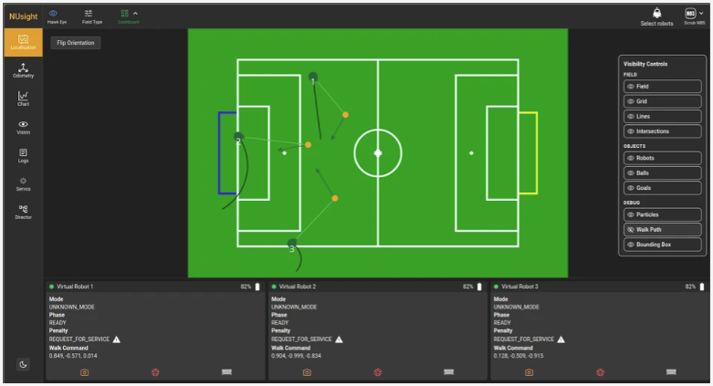
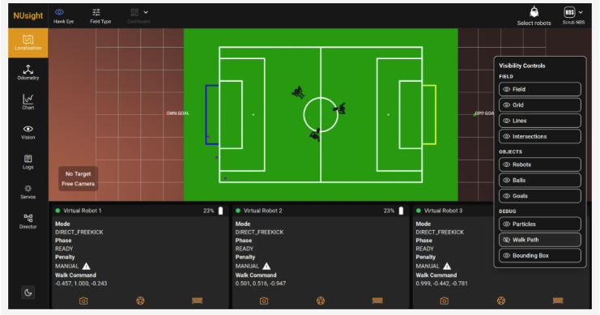
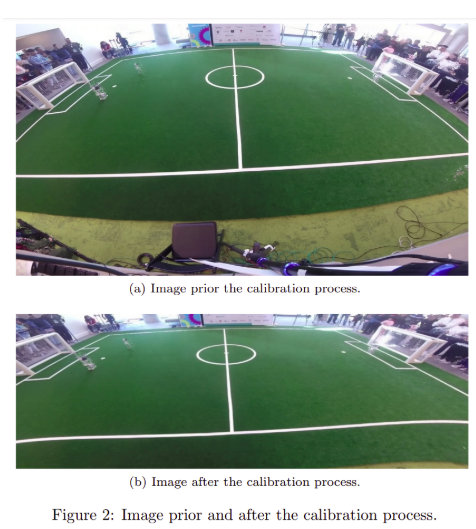
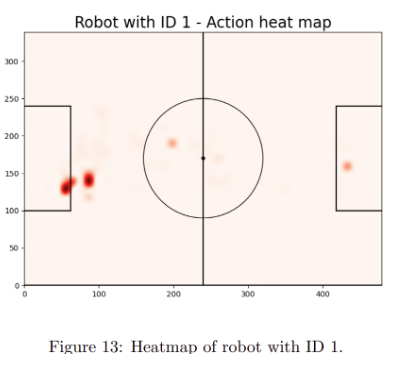
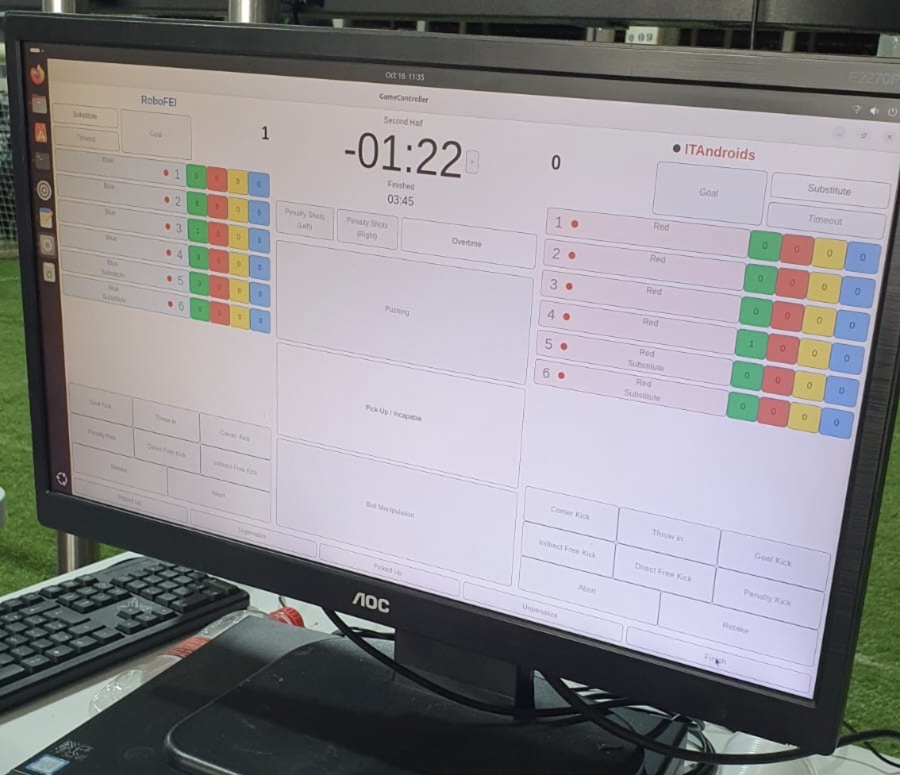
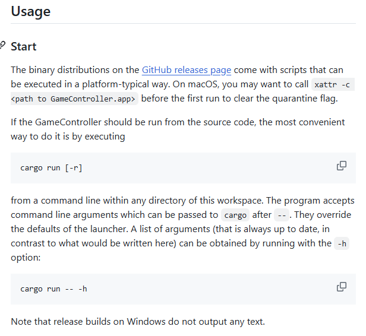
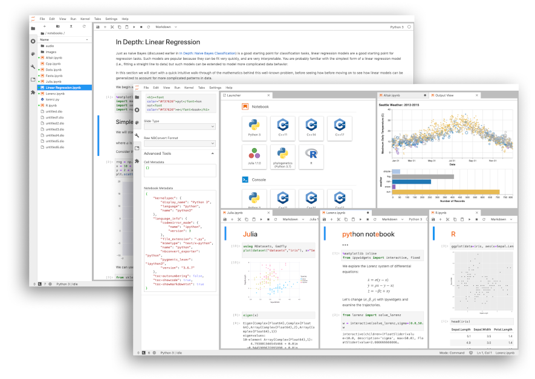
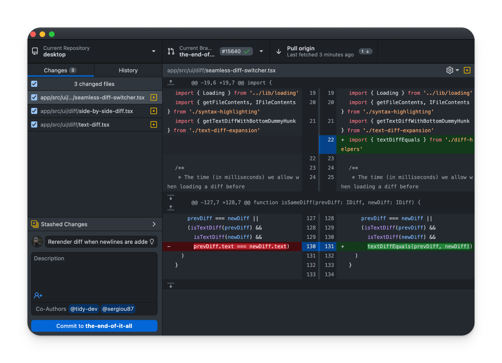
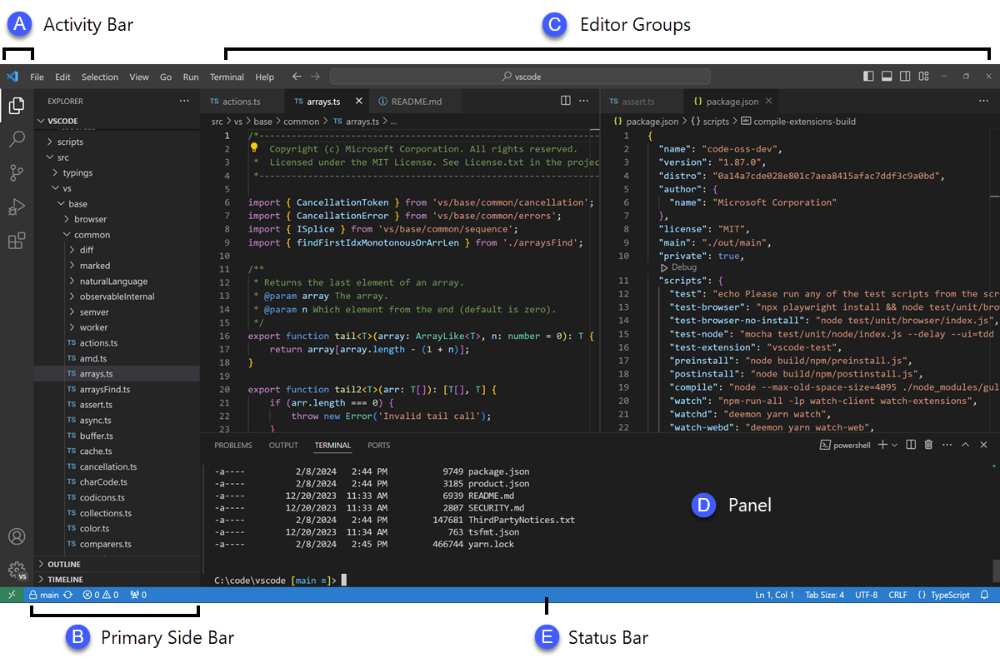

# Entrega 2 — Público-alvo e análise de concorrência

**Data:** 19/08/2026
**Status:** 🟩 Concluído

**Responsabilidade mínima:** cada integrante analisa pelo menos 1 concorrente/interface representativa; a equipe produz síntese comparativa.

## Objetivo da atividade

Compreender soluções do mesmo domínio **e também interfaces familiares ao público-alvo**. O objetivo não é copiar telas, mas identificar convenções, padrões, affordances percebidas, problemas recorrentes, expectativas e oportunidades de design.

> **Concorrente não precisa ser idêntico ao produto.** Pode atuar na mesma área, resolver objetivo semelhante ou disputar a mesma necessidade. Quando não houver concorrente direto, use produtos análogos e softwares que o público já utiliza.

### Para TCCs que não previam interface

Não procure apenas um “concorrente do algoritmo”. Investigue **interfaces profissionais que materializam atividades semelhantes** às que o usuário escolhido precisaria realizar.

Exemplos:

* TCC de banco de dados → consoles de administração, ferramentas para DBA, monitoramento e análise de consultas;
* TCC de LLM/ML → painéis de experimentos, gestão de modelos/datasets, comparação de métricas, revisão de resultados;
* TCC de análise de dados → dashboards, ferramentas de BI, filtros, relatórios e exploração;
* TCC de infraestrutura/API → portais administrativos, observabilidade, logs, gestão de credenciais e uso;
* TCC de cibersegurança → consoles de alertas, triagem, histórico e auditoria.

A pergunta é: **“que convenções esse perfil já conhece para executar tarefas equivalentes?”**

## Entrada obrigatória da Entrega 1

Na Entrega 1, não citamos nenhum software. Estaremos citando pela primeira vez:

| Item citado na Entrega 1 | Tipo               | Por que foi citado                                                                                                               | Status inicial | Decisão nesta entrega |
| ------------------------ | ------------------ | -------------------------------------------------------------------------------------------------------------------------------- | -------------- | --------------------- |
| NuSight                  | Análogo            | Interface relacionada ao acompanhamento de robôs e à visualização de informações técnicas e de desempenho.                       | —              | Analisar              |
| MARIO                    | Análogo            | Solução relacionada ao processamento e análise de dados de partidas de robôs, com organização modular e geração de estatísticas. | —              | Analisar              |
| GameController           | Indireto / análogo | Software diretamente relacionado ao futebol de robôs humanoides, utilizado para configurar, controlar e acompanhar partidas.     | —              | Analisar              |

> **Observação:** Como os três softwares não foram citados na Entrega 1, eles não possuem um status inicial ou hipótese (`H01`, `H02` etc.) associado à etapa anterior. Por isso, nesta entrega eles são tratados como novas soluções selecionadas para análise comparativa.

| {{...}} | concorrente / análogo / ferramenta cotidiana / processo manual | {{...}} | F / H / ? | analisar / descartar com justificativa |

Se uma hipótese da Entrega 1 for confirmada ou refutada durante esta análise, atualize `H01`, `H02`... em [`../RASTREABILIDADE.md`](../RASTREABILIDADE.md).

## 1. Público-alvo desta análise

O público alvo desta análise são integrantes de equipes de robótica humanoide e pesquisadores ou desenvolvedores da área.

## 2. Concorrentes diretos/indiretos

### Análise C01 — NuSight

**Autor(a):** Manuella Filipe Peres - 22.224.029-3
**Tipo:** análogo
**Link oficial:** [NuSight](https://nubook.nubots.net/system/tools/nusight#page-content)
**Data de acesso:** 19/08/2026

#### Contexto e proposta

O NUbook é a documentação e handbook da equipe NUbots, grupo de pesquisa em robótica da University of Newcastle voltado ao desenvolvimento de robôs humanoides para futebol na RoboCup. A plataforma reúne informações sobre a equipe, áreas de pesquisa, publicações, histórico, hardware, sistemas de software, ferramentas e guias para contribuição na equipe.

O NUbook foi analisado como uma interface profissional representativa porque o público do projeto possui características semelhantes às dos usuários considerados para o projeto, ou seja, integrantes de equipes de robótica e pesquisadores que precisam consultar, organizar e compreender informações técnicas relacionadas ao desenvolvimento de robôs humanoides.

#### Funcionalidades relevantes

| Funcionalidade                          | Como é realizada                                                                                      | Evidência/print                                                     | Observação de IHC                                                            |
| --------------------------------------- | ----------------------------------------------------------------------------------------------------- | ------------------------------------------------------------------- | ---------------------------------------------------------------------------- |
| Dashboard com informações em tempo real | Campo dispondo dos jogadores e seu estado.                                                            |  | Permite observar ao vivo a performance do robô.                              |
| Documentação técnica                    | O site apresenta informações sobre hardware, software, sistemas e ferramentas utilizados pela equipe. |    | Centraliza informações que poderiam estar distribuídas em diferentes fontes. |

#### Experiência do usuário e opiniões

[?] O ponto positivo do software é a facilidade na visualização do desempenho do robô. Por outro lado, a quantidade de informações técnicas pode exigir que o usuário conheça previamente a organização da equipe para encontrar determinados conteúdos.

#### Preço/modelo de negócio

O NUbook é disponibilizado como documentação pública da equipe NUbots. Não foi identificado modelo de cobrança ou comercialização da plataforma.

#### Padrões e tendências percebidos

* Separação entre informações sobre equipe, sistemas e guias
* Navegação por categorias
* Centralização de documentação técnica
* Registro de histórico e conhecimento da equipe.

#### Pontos positivos, limitações e lições

| Ponto                        | Evidência                                                                 | Implicação para nosso projeto                                                                 |
| ---------------------------- | ------------------------------------------------------------------------- | --------------------------------------------------------------------------------------------- |
| Centralização de informações | Hardware, software, ferramentas e pesquisas estão reunidos na plataforma. | Informações relacionadas aos treinamentos podem ser centralizadas.                            |
| Guias e documentação         | Existe uma seção específica de Guides.                                    | Pode ser interessante oferecer ajuda ou explicações para parâmetros e métricas mais técnicas. |

### Análise C02 — Mario

**Autor(a):** Letizia Lowatzki Baptistella - 22.125.063-2
**Tipo:** análogo
**Link oficial:** [MARIO](https://sites.google.com/unibas.it/wolves/robocup/robocup-2022/mario)
**Data de acesso:** 19/08/2026

#### Contexto e proposta

O MARIO (Modular and Extensible Architecture for Computing Visual Statistics in RoboCup SPL) é uma arquitetura desenvolvida para gerar estatísticas visuais a partir de vídeos de partidas da RoboCup Standard Platform League. O projeto foi desenvolvido no contexto do Open Research Challenge da RoboCup 2022 e possui uma arquitetura modular, na qual diferentes módulos realizam tarefas específicas de processamento e análise.

A solução foi analisada como análogo porque, apesar de não realizar o treinamento do robô, possui um fluxo semelhante ao contexto do projeto como entrada de dados, processamento, acompanhamento de etapas e análise dos resultados.

#### Funcionalidades relevantes

| Funcionalidade          | Como é realizada                                                                    | Evidência/print                                                  | Observação de IHC                                                          |
| ----------------------- | ----------------------------------------------------------------------------------- | ---------------------------------------------------------------- | -------------------------------------------------------------------------- |
| Calibração              | O sistema realiza a calibração da câmera para corrigir distorções.                  |  | O processamento possui uma etapa específica e identificável.               |
| Geração de estatísticas | Os dados dos jogadores e da bola são utilizados para gerar estatísticas da partida. |                     | Facilita a interpretação dos resultados por meio de informações derivadas. |

#### Experiência do usuário e opiniões

[?] Um aspecto positivo é a modularidade do sistema, pois diferentes etapas possuem funções específicas. Isso pode facilitar a compreensão do fluxo de processamento e a identificação da etapa em que determinado resultado foi produzido.

#### Preço/modelo de negócio

Não foi identificado modelo de cobrança ou comercialização da plataforma.

#### Padrões e tendências percebidos

* Organização modular
* Processamento dividido em etapas
* Feedback visual
* Transformação de dados técnicos em estatísticas
* Uso de visualizações para auxiliar a interpretação dos resultados.

#### Pontos positivos, limitações e lições

| Ponto           | Evidência                                                     | Implicação para nosso projeto                                          |
| --------------- | ------------------------------------------------------------- | ---------------------------------------------------------------------- |
| Modularidade    | O MARIO divide o processamento em módulos específicos.        | O fluxo da interface pode separar configuração, treinamento e análise. |
| Feedback visual | O tracking apresenta informações sobre os objetos detectados. | O treinamento pode apresentar visualmente o comportamento do robô.     |

### Análise C03 — GameController

**Autor(a):** Rafaela Altheman de Campos - 22.125.062-4
**Tipo:** indireto/análogo
**Link oficial:** [GameController](https://github.com/RoboCup-HumanoidSoccerLeague/GameController)
**Data de acesso:** 19/08/2026

#### Contexto e proposta

O GameController é um software utilizado para controlar partidas de futebol de robôs da RoboCup Humanoid Soccer League. A aplicação permite configurar a competição, selecionar as equipes, definir parâmetros relacionados à partida e controlar informações durante sua execução. O projeto possui uma interface gráfica e componentes responsáveis por comunicação, execução, logs e gerenciamento do estado da partida.

Ele foi selecionado como solução indireta/análogo porque está diretamente relacionado ao contexto de futebol de robôs humanoides e apresenta uma interface utilizada para configurar, controlar e acompanhar uma atividade realizada por robôs.

#### Funcionalidades relevantes

| Funcionalidade       | Como é realizada                                                              | Evidência/print                                                                         | Observação de IHC                                                |
| -------------------- | ----------------------------------------------------------------------------- | --------------------------------------------------------------------------------------- | ---------------------------------------------------------------- |
| Configuração inicial | O Launcher permite selecionar competição, equipes, cores e interface de rede. |  | Reúne as configurações necessárias antes do início da atividade. |
| Controle da partida  | A interface principal permite acompanhar e controlar o estado do jogo.        |                | Mantém informações importantes disponíveis durante a atividade.  |

#### Experiência do usuário e opiniões

[?] Um ponto relevante para IHC é a prevenção de erros durante a configuração, pois o sistema verifica condições como equipes distintas e ausência de conflitos entre as cores antes de permitir o início da partida.

#### Preço/modelo de negócio

Não foi identificado modelo de cobrança pelo uso do software.

#### Padrões e tendências percebidos

* Configuração antes da execução
* Validação de dados
* Feedback do estado atual
* Interface voltada para controle em tempo real

#### Pontos positivos, limitações e lições

| Ponto                          | Evidência                                                                      | Implicação para nosso projeto                                                                                     |
| ------------------------------ | ------------------------------------------------------------------------------ | ----------------------------------------------------------------------------------------------------------------- |
| Configuração antes da execução | O Launcher reúne os parâmetros necessários antes de iniciar a partida.         | O treinamento pode possuir uma etapa clara de configuração antes da execução.                                     |
| Feedback de estado             | A interface principal apresenta informações relacionadas ao estado da partida. | A interface pode informar claramente se o treinamento está configurado, executando, concluído ou apresentou erro. |

## 3. Softwares que o público-alvo usa no cotidiano

Analise interfaces que moldam a expectativa do público, mesmo que não sejam concorrentes.

| Software         | Por que o público usa                                                              | Padrões relevantes                                                          | Prints                                                        | O que aprender                                                                                                           |
| ---------------- | ---------------------------------------------------------------------------------- | --------------------------------------------------------------------------- | ------------------------------------------------------------- | ------------------------------------------------------------------------------------------------------------------------ |
| Jupyter Notebook | Executar experimentos, analisar dados, visualizar gráficos e registrar resultados. | Células, gráficos, execução por etapas e organização do experimento.        |  | Manter resultados próximos às informações que os geraram pode facilitar a interpretação.                                 |
| GitHub           | Armazenar código, acompanhar alterações e colaborar no desenvolvimento.            | Navegação por projetos, histórico, versionamento e organização de arquivos. |                | Histórico e organização ajudam na rastreabilidade das alterações.                                                        |
| VS Code          | Desenvolver e executar código utilizado nos experimentos.                          | Abas, terminal, explorador de arquivos, extensões e feedback de execução.   |               | Reunir diferentes recursos de desenvolvimento em uma interface pode reduzir a necessidade de alternar entre ferramentas. |

## 3.1 Padrões de interface relevantes ao escopo de IHC

Registre somente padrões encontrados nas soluções analisadas e que possam ter relação com objetivos reais da equipe.

| Padrão observado                      | Produto(s)                | Para qual tarefa serve                                                               | Vantagem percebida                                                             | Risco/limitação                                                                              | Aplicável ao nosso escopo? |
| ------------------------------------- | ------------------------- | ------------------------------------------------------------------------------------ | ------------------------------------------------------------------------------ | -------------------------------------------------------------------------------------------- | -------------------------- |
| **Execução por etapas**               | Jupyter Notebook          | Executar experimentos e acompanhar cada etapa do processamento.                      | Facilita a organização e o acompanhamento do experimento.                      | Muitos passos ou células podem dificultar a compreensão do fluxo.                            | **Não**                    |
| **Visualização de resultados**        | Jupyter Notebook          | Analisar dados e visualizar gráficos gerados pelos experimentos.                     | Facilita a interpretação dos resultados por meio de representações visuais.    | O excesso de gráficos e informações pode dificultar a análise.                               | **Sim**                    |
| **Histórico e versionamento**         | GitHub                    | Acompanhar alterações no código e consultar versões anteriores.                      | Favorece a rastreabilidade das alterações e dos experimentos.                  | A quantidade de versões e informações pode tornar a navegação mais complexa.                 | **Sim**                    |
| **Organização por projetos/arquivos** | GitHub; VS Code           | Organizar códigos, arquivos e recursos utilizados no desenvolvimento.                | Facilita a localização e o gerenciamento dos arquivos relacionados ao projeto. | Estruturas muito grandes podem dificultar a localização de informações.                      | **Sim**                    |
| **Abas e recursos integrados**        | VS Code                   | Desenvolver e executar código utilizando diferentes recursos em uma mesma interface. | Reduz a necessidade de alternar entre diferentes ferramentas.                  | Uma interface com muitos recursos pode aumentar a complexidade visual.                       | **Sim**                    |
| **Feedback de execução**              | Jupyter Notebook; VS Code | Acompanhar a execução de código e identificar resultados ou problemas.               | Permite perceber rapidamente o resultado de uma ação ou execução.              | Mensagens de erro ou resultados muito extensos podem dificultar a identificação do problema. | **Sim**                    |
| **Comparação/análise de resultados**  | Jupyter Notebook          | Analisar e interpretar os resultados obtidos nos experimentos.                       | Facilita a avaliação dos resultados gerados durante os experimentos.           | A comparação pode se tornar difícil quando há muitos resultados simultâneos.                 | **Sim**                    |

> O objetivo não é concluir “todo concorrente tem dashboard, então teremos um”. O padrão só será adotado se apoiar uma tarefa rastreável.

## 4. Síntese comparativa da equipe

| Critério                      | C01 — NuSight                                                 | C02 — MARIO                                                   | C03 — GameController                                          | Oportunidade para o projeto                                                                  |
| ----------------------------- | ------------------------------------------------------------- | ------------------------------------------------------------- | ------------------------------------------------------------- | -------------------------------------------------------------------------------------------- |
| Navegação                     | Organização por categorias e seções.                          | Fluxo dividido em módulos/etapas.                             | Launcher separado da interface principal.                     | Organizar o treinamento em etapas e categorias claras.                                       |
| Feedback/estado               | Dashboard permite acompanhar o estado/performance do robô.    | Tracking e estatísticas fornecem feedback visual.             | Interface apresenta o estado da partida.                      | Tornar o estado do treinamento e do robô sempre visível.                                     |
| Prevenção/recuperação de erro | Não há evidência específica suficiente no material analisado. | O processamento é dividido em etapas identificáveis.          | Valida condições antes de permitir o início da partida.       | Validar configurações antes da execução e informar claramente os erros.                      |
| Terminologia                  | Estrutura técnica voltada à equipe de robótica.               | Termos relacionados a tracking, estatísticas e processamento. | Termos relacionados a competição, equipes e configuração.     | Utilizar termos familiares a integrantes de equipes de robótica.                             |
| Acessibilidade                | Não há evidência específica suficiente no material analisado. | Não há evidência específica suficiente no material analisado. | Não há evidência específica suficiente no material analisado. | Investigar acessibilidade em etapa posterior, sem inferir conclusões a partir desta análise. |
| Eficiência                    | Centraliza documentação e informações técnicas.               | Modularidade facilita localizar etapas do processamento.      | Configuração reúne parâmetros antes da execução.              | Reduzir alternância entre ferramentas e manter informações relacionadas próximas à tarefa.   |

## 5. Recomendações derivadas

Liste recomendações com origem explícita.

* **RC01:** Manter o estado do treinamento e do robô visível durante a execução - derivada de **C01 (NuSight)** e **C03 (GameController)**.
* **RC02:** Organizar o fluxo de treinamento em etapas claras de configuração, execução e análise dos resultados - derivada de **C02 (MARIO)** e **C03 (GameController)**.
* **RC03:** Apresentar métricas e resultados do treinamento por meio de visualizações que facilitem sua interpretação - derivada de **C02 (MARIO)** e **Jupyter Notebook**.
* **RC04:** Validar os parâmetros antes do início do treinamento e apresentar mensagens claras quando houver configurações inválidas - derivada de **C03 (GameController)**.
* **RC05:** Centralizar informações relacionadas ao treinamento em uma mesma interface, reduzindo a necessidade de alternar entre diferentes ferramentas - derivada de **C01 (NuSight)** e **VS Code**.
* **RC06:** Manter histórico dos treinamentos e dos resultados obtidos para permitir comparação e rastreabilidade dos experimentos - derivada de **GitHub**.

## Referências

NuSight: https://nubook.nubots.net/system/tools/nusight#page-content

MARIO: https://sites.google.com/unibas.it/wolves/robocup/robocup-2022/mario

GameController: https://github.com/RoboCup-HumanoidSoccerLeague/GameController

## Checklist

* [x] O mapa inicial de alternativas da Entrega 1 foi revisitado e aprofundado.
* [x] Hipóteses relevantes sobre mercado/padrões foram atualizadas na rastreabilidade quando surgiram evidências.
* [x] Há pelo menos uma análise completa por integrante.
* [x] Cada análise contém prints legíveis da interface.
* [x] Prints mostram telas/estados relevantes, não apenas logos/homepage.
* [x] Foram analisados concorrentes e/ou interfaces representativas ao público.
* [x] Em TCC sem interface original, foram investigadas ferramentas profissionais análogas às atividades do usuário escolhido.
* [x] Padrões como dashboard, relatório, filtros e CRUD foram analisados como soluções para tarefas, não como requisitos automáticos.
* [x] Opiniões de UX têm fonte.
* [x] A síntese compara critérios comuns e produz recomendações.
* [x] Não há “copiar porque o concorrente faz”; há justificativa de adequação ao público/contexto.
