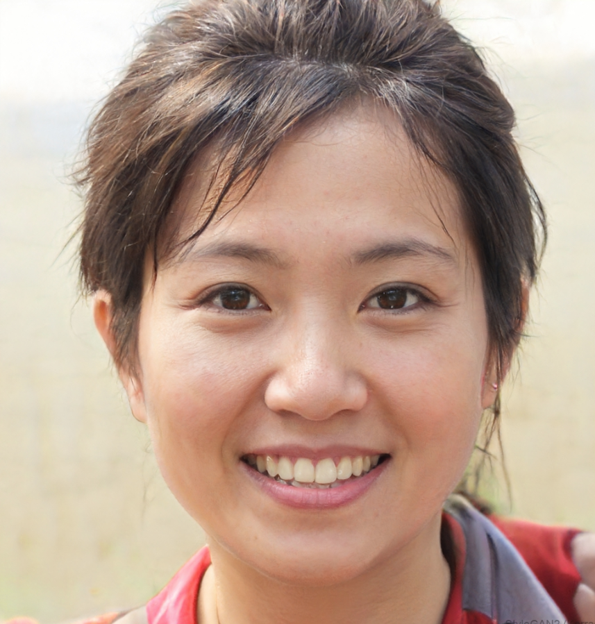
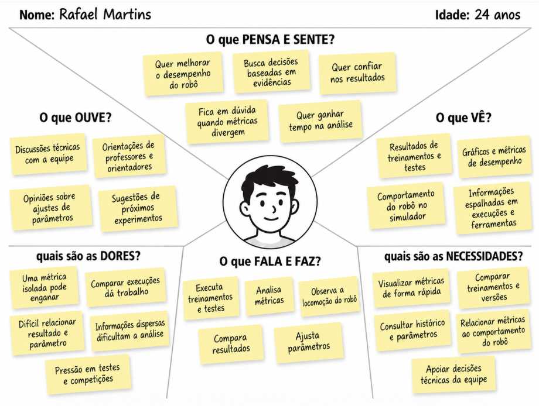

# Entrega 3 — Personas, mapa de empatia, contexto de uso e jornada

**Data:** {{02/09/2026}}  
**Status:** 🟩 Concluida
**Responsabilidade:** 1 persona por integrante; 1 mapa de empatia, 1 contexto de uso consolidado e 1 jornada por equipe (salvo orientação diferente do docente).

## Objetivo da atividade

Representar grupos de usuários de forma útil para decisões de design. Persona não é personagem decorativo: suas características devem alterar requisitos, prioridades, linguagem, fluxos ou critérios de avaliação.

## Atenção a projetos técnicos

Em TCCs sem interface original, a persona pode representar um **profissional que se apropria da contribuição técnica**: DBA, analista, cientista de dados, administrador, pesquisador, técnico, operador, gestor ou especialista de domínio.

Não escolha um perfil apenas porque “parece combinar” com a tecnologia. Explique **qual objetivo esse perfil teria e qual parte da contribuição do TCC produziria valor para ele**. Se ainda for hipótese, mantenha como hipótese/proto-persona a validar.

Também considere papéis diferentes quando houver tarefas distintas, por exemplo:

- operador que executa análises;
- administrador que configura e gerencia permissões;
- especialista que interpreta resultados;
- gestor que consulta relatórios e decide;
- auditor que revisa histórico.

## Entradas da Entrega 1

Antes de criar personas, foram retomados os principais usuários, objetivos, características e hipóteses identificados na Entrega 1. As informações que ainda não possuem validação com usuários continuam sendo tratadas como hipóteses nesta entrega.

| Item da Entrega 1 | Status inicial | Evidência disponível agora | Como será tratado nesta entrega |
|---|---|---|---|
| Integrante de equipe de robótica humanoide responsável por analisar e melhorar o desempenho do robô | [F] | Esse foi o perfil priorizado pela equipe para o projeto de IHC na Entrega 1. | Incorporar como persona primária P01. |
| Usuários possuem conhecimento técnico em robótica e familiaridade com métricas de desempenho | [H] | A análise de concorrentes da Entrega 2 mostrou o uso de interfaces e ferramentas técnicas nesse contexto, mas não houve validação direta com usuários. | Manter como hipótese na persona. |
| O usuário precisa analisar diferentes métricas para avaliar corretamente o desempenho do robô | [F] | a metodologia utiliza métricas como recompensa, velocidade, distância percorrida e taxa de quedas, além da observação do comportamento do robô. | Incorporar aos objetivos, tarefas e necessidades da persona. |
| Organizar as informações de forma visual e comparável pode facilitar a interpretação dos resultados | [H] | A Entrega 2 identificou padrões de visualização, histórico e comparação em ferramentas semelhantes, mas a necessidade ainda não foi validada diretamente com usuários. | Manter como hipótese e investigar nas próximas etapas. |
| Manter histórico de testes e resultados pode ajudar a acompanhar a evolução do robô | [H] | O projeto já possui necessidade de registrar configurações e resultados para comparação e reprodutibilidade, mas o formato da futura interface ainda é uma hipótese. | Incorporar como necessidade provável da persona e manter como hipótese. |
| O usuário busca entender o desempenho do robô e identificar pontos de melhoria | [F] | Esse objetivo está relacionado ao processo de treinamento, avaliação e ajuste realizado no próprio projeto. | Incorporar como objetivo principal da persona P01. |

## 1. Personas

### Persona P01 — Rafael Martins

**Autor(a):** Rafaela Altheman de Campos — 22.125.062-4  
**Tipo:** primária  
**Base de evidências:** experiência da equipe
**Hipóteses da Entrega 1 relacionadas:** H01, H02, H03

| Campo | Descrição |
|---|---|
| Faixa etária / contexto relevante | 24 anos; participa ativamente de uma equipe de robótica humanoide e está envolvido no desenvolvimento e testes do robô. [H] |
| Ocupação/papel | Integrante técnico de equipe de robótica humanoide, responsável por desenvolver, testar e avaliar comportamentos do robô. [H] |
| Conhecimento do domínio | Conhece conceitos de robótica humanoide, locomoção bípede, treinamento e métricas de desempenho. [H] |
| Experiência tecnológica | Alta: utiliza ambientes de simulação, ferramentas de desenvolvimento, scripts e ferramentas para análise de dados. [H] |
| Objetivos | Melhorar o desempenho, reduzir quedas, aumentar a estabilidade e velocidade e identificar quais alterações realmente melhoram o robô. [F/H] |
| Necessidades | Visualizar métricas de forma rápida, comparar diferentes treinamentos e versões, consultar histórico e relacionar métricas com o comportamento observado do robô. [H] |
| Dores/frustrações | Precisa analisar informações distribuídas entre diferentes execuções, métricas e observações visuais. Pode interpretar um treinamento de forma incorreta quando uma métrica isolada apresenta bons resultados. [F/H] |
| Motivadores | Obter um robô mais estável e competitivo, economizar tempo nos ciclos de treinamento e tomar decisões técnicas com base em evidências. [H] |
| Restrições/acessibilidade | Pode trabalhar sob pressão durante períodos de testes e preparação para competições. Necessita de informações técnicas sem excesso de simplificação. [H] |
| Ambiente típico de uso | Laboratório de robótica ou ambiente de desenvolvimento, utilizando computador ou notebook durante treinamentos, testes e preparação para competições. [H] |
| Comportamentos relevantes | Executa diversos ciclos de treinamento, acompanha métricas, observa o comportamento do robô, compara resultados e ajusta parâmetros para novos experimentos. [F/H] |

**Decisões de design influenciadas por P01:**

- Priorizar uma visão rápida das principais métricas de desempenho, sem esconder informações técnicas importantes.
- Permitir comparação direta entre diferentes treinamentos, versões e execuções.
- Apresentar métricas como velocidade, distância percorrida, recompensa, taxa de quedas, número de gols e números de passes, evitando que o usuário dependa de uma única métrica.
- Disponibilizar histórico e filtros para localizar rapidamente testes anteriores.
- Utilizar vocabulário técnico familiar ao usuário, como recompensa, agente, velocidade, torque e taxa de quedas.
- Facilitar a relação entre resultados quantitativos e o comportamento visual do robô.

---

### Persona P02 — Marina Oliveira

**Autor(a):** Manuella Filipe Peres — 22.224.029-3  
**Tipo:** primária  
**Base de evidências:** experiência da equipe
**Hipóteses da Entrega 1 relacionadas:** H01, H02, H03

| Campo | Descrição |
|---|---|
| Faixa etária / contexto relevante | 27 anos; pesquisadora que atua diretamente no desenvolvimento de um robô de robótica humanoide [H] |
| Ocupação/papel | Pesquisadora de robótica responsável por estudar, testar e aprimorar o comportamento e a locomoção do robô. [H] |
| Conhecimento do domínio | Avançado em robótica e aprendizado de máquina, com conhecimento sobre locomoção humanoide, treinamento de agentes e avaliação de desempenho de robôs. [H] |
| Experiência tecnológica | Tem experiência alta: utiliza ferramentas de programação, simulação, treinamento, coleta de dados, visualização de métricas e análise de resultados. [H] |
| Objetivos | Melhorar o desempenho do robô, testar diferentes estratégias de locomoção, identificar configurações mais eficientes e compreender os resultados obtidos durante os treinamentos. [H] |
| Necessidades | Acessar rapidamente os resultados dos treinamentos, comparar diferentes experimentos, visualizar métricas de desempenho e consultar os parâmetros utilizados em cada execução. [H] |
| Dores/frustrações | A quantidade de experimentos e dados gerados durante os treinamentos pode dificultar a comparação entre resultados. Também pode ser trabalhoso identificar quais alterações nos parâmetros realmente contribuíram para a melhora ou piora do robô. [H] |
| Motivadores | Melhorar o desempenho do robô, reduzir o tempo necessário para análise dos experimentos, encontrar configurações mais eficientes e obter resultados confiáveis para orientar os próximos treinamentos. [H] |
| Restrições/acessibilidade | Possui conhecimento técnico elevado, mas trabalha com grande quantidade de informações e resultados simultaneamente. A interface deve facilitar a análise sem esconder informações importantes para a pesquisa. [H] |
| Ambiente típico de uso | Laboratório de robótica ou ambiente de desenvolvimento, utilizando computador para executar treinamentos, acompanhar testes e analisar os resultados do robô. [H] |
| Comportamentos relevantes | Executa treinamentos e testes, altera parâmetros do robô, acompanha métricas, compara diferentes execuções, analisa o comportamento do robô e utiliza os resultados para definir novos experimentos. [H] |

**Decisões de design influenciadas por P02:**

- Permitir comparar diferentes treinamentos e execuções do robô.
- Exibir as principais métricas de desempenho de maneira clara e objetiva.
- Permitir consultar os parâmetros utilizados em cada treinamento.
- Facilitar a identificação de melhorias ou regressões no desempenho do robô.
- Disponibilizar histórico dos experimentos para evitar a perda de informações de treinamentos anteriores.
- Apresentar informações técnicas suficientes para apoiar decisões de pesquisa sem sobrecarregar a visualização inicial.
- Permitir relacionar os resultados quantitativos das métricas com o comportamento observado no robô.

---

### Persona P03 — Carlos Almeida

**Autor(a):** Letizia Lowatzki Baptistella — 22.125.063-2  
**Tipo:** primária  
**Base de evidências:** participação de professores e orientadores no projeto
**Hipóteses da Entrega 1 relacionadas:** H01, H02

| Campo | Descrição |
|---|---|
| Faixa etária / contexto relevante | 52 anos; acompanha projetos de pesquisa ou equipes de robótica e participa de decisões técnicas. [H] |
| Ocupação/papel | Professor, orientador ou responsável técnico que acompanha o desenvolvimento de robôs humanoides. [F/H] |
| Conhecimento do domínio | Alto conhecimento em robótica e pesquisa, mas pode não acompanhar todos os detalhes das implementações e dos treinamentos realizados pela equipe. [H] |
| Experiência tecnológica | Alta, especialmente em ferramentas de pesquisa, análise de resultados e acompanhamento de experimentos. [H] |
| Objetivos | Avaliar a evolução do projeto, identificar problemas relevantes e orientar a equipe na escolha de próximos experimentos e melhorias. [F/H] |
| Necessidades | Obter uma visão consolidada do desempenho, comparar resultados importantes e compreender rapidamente quais aspectos evoluíram ou pioraram. [H] |
| Dores/frustrações | Não participa necessariamente de todos os experimentos e pode precisar compreender resultados produzidos por outros integrantes. Consultar informações fragmentadas pode dificultar o acompanhamento da evolução do projeto. [H] |
| Motivadores | Acompanhar o progresso da equipe, apoiar decisões técnicas e verificar se os resultados obtidos são coerentes com os objetivos do projeto. [H] |
| Restrições/acessibilidade | Possui pouco tempo disponível para analisar cada experimento individualmente. A interface deve permitir uma leitura rápida, mas possibilitar acesso aos detalhes quando necessário. [H] |
| Ambiente típico de uso | Universidade, laboratório ou reuniões da equipe, utilizando computador ou notebook para acompanhar resultados e discutir decisões técnicas. [H] |
| Comportamentos relevantes | Consulta resultados consolidados, compara versões ou experimentos relevantes, questiona resultados inesperados e utiliza as informações para orientar a equipe. [H] |

**Decisões de design influenciadas por P03:**

- Disponibilizar uma visão geral do desempenho antes de apresentar detalhes técnicos.
- Destacar mudanças relevantes entre versões e experimentos.
- Permitir acessar detalhes de uma execução quando houver necessidade de investigação.
- Utilizar gráficos e indicadores que facilitem a interpretação rápida da evolução do robô.
- Evitar sobrecarregar a visão inicial com parâmetros de baixo nível.
- Permitir gerar ou consultar relatórios que possam apoiar discussões e decisões da equipe.

### Síntese das personas

As três personas representam diferentes formas de interação com os resultados do desenvolvimento de robôs humanoides. Rafael é o usuário técnico e primário, que realiza treinamentos, acompanha métricas e toma decisões diretamente relacionadas ao desenvolvimento do walking. Marina representa o contexto de pesquisa, no qual a comparação e a reprodutibilidade dos experimentos são importantes. Carlos representa o papel de orientação e tomada de decisão, necessitando principalmente compreender a evolução geral e identificar problemas relevantes sem necessariamente acompanhar cada execução.

A Persona P01 (Rafael Martins) é considerada prioritária para o projeto de IHC, pois corresponde mais diretamente ao perfil definido na Entrega 1: integrante de uma equipe de robótica humanoide responsável por acompanhar, analisar e contribuir para a melhoria do desempenho do robô. O objetivo principal da interface é justamente apoiar esse usuário na visualização, comparação e interpretação dos resultados. [F] 

As características de Marina e Carlos permanecem parcialmente como proto-personas, pois a Entrega 1 ainda não apresenta entrevistas ou questionários específicos com pesquisadores externos e professores/orientadores. Portanto, suas características devem ser validadas nas próximas etapas, especialmente na investigação das hipóteses H01, H02 e H03.

## 2. Mapa de empatia — equipe

**Persona escolhida:** P01 — Rafael Martins
**Justificativa:** Rafael foi escolhido porque representa o perfil prioritário: o integrante técnico de uma equipe de robótica humanoide que acompanha resultados, compara execuções e utiliza essas informações para decidir quais aspectos do robô precisam ser melhorados. Como as características detalhadas desse perfil ainda não foram validadas diretamente com usuários, o mapa mantém como hipótese tudo o que ultrapassa a experiência da própria equipe.

Documente também em texto: o que vê; ouve; diz/faz; pensa/sente; dores; ganhos. Diferencie **evidência** de **hipótese**.

O que vê

[F] Rafael acompanha treinamentos, gráficos e métricas como recompensa, velocidade, distância e taxa de quedas, além de observar o comportamento do robô. Essas informações podem estar distribuídas entre diferentes execuções e ferramentas.

O que ouve

[H] Participa de discussões com integrantes da equipe, professores e orientadores sobre o desempenho do robô e possíveis ajustes nos próximos experimentos.

O que diz e faz

[H] Executa ou acompanha treinamentos, analisa métricas, observa o robô e compara resultados para decidir quais ajustes devem ser realizados.

O que pensa e sente

[H] Quer ter confiança de que os resultados realmente representam uma melhora no comportamento do robô e pode ter dúvidas quando diferentes métricas apontam conclusões distintas.

Dores

[H] Pode ter dificuldade para comparar execuções, recuperar parâmetros antigos e interpretar corretamente o desempenho quando as informações estão dispersas ou quando uma única métrica parece positiva.

Ganhos

[H] Busca visualizar e comparar resultados com mais facilidade, consultar o histórico dos experimentos e identificar rapidamente melhorias ou regressões para apoiar as decisões da equipe.

## 3. Contexto de uso — consolidação

| Dimensão | Descrição | Implicação de design |
|---|---|---|
| Usuários | [F] No contexto do TCC, os principais envolvidos são integrantes da equipe de robótica que realizam treinamentos, analisam resultados e participam das decisões técnicas. [H] Pesquisadores e professores/orientadores também podem utilizar a interface para acompanhar e interpretar os resultados. | Priorizar o integrante técnico da equipe como usuário principal, mantendo informações detalhadas para análise e uma visão mais resumida para acompanhamento. |
| Tarefas | [F] A equipe executa treinamentos, acompanha métricas, observa o comportamento do robô e compara resultados para decidir os próximos ajustes. [H] A futura interface pode reunir essas informações em um único ambiente para facilitar a análise. | A interface deve facilitar a visualização de métricas, comparação de resultados, consulta de parâmetros e identificação de melhorias ou regressões. |
| Equipamentos | [F] No TCC, os treinamentos e análises são realizados em computadores utilizados pela equipe. [H] A futura interface provavelmente será utilizada principalmente em computadores ou notebooks. | Projetar a interface prioritariamente para telas de computador, com espaço adequado para gráficos, tabelas, métricas e comparações. |
| Ambiente físico | [H] A utilização pode ocorrer principalmente em laboratórios de robótica, ambientes de desenvolvimento ou durante reuniões da equipe. Também pode existir maior pressão de tempo em períodos próximos a testes e competições. | Organizar as informações de forma clara e evitar excesso de elementos, permitindo que o usuário encontre rapidamente os dados mais importantes. |
| Ambiente social/organizacional | [F] O desenvolvimento do projeto ocorre de forma colaborativa entre integrantes da equipe e possui acompanhamento de professores e orientadores. [H] Os resultados da interface podem ser utilizados durante discussões para decidir os próximos experimentos e ajustes. | Manter informações de contexto de cada treinamento ou teste para que os resultados possam ser compreendidos e discutidos por diferentes integrantes da equipe. |
| Papéis/permissões/governança | [?] Ainda não sabemos se será necessário definir diferentes níveis de acesso ou permissões entre integrantes da equipe, pesquisadores e orientadores. | Não criar um sistema complexo de permissões nesta etapa. Essa necessidade deve ser investigada antes de ser incluída no projeto. |
| Volume de dados/histórico | [F] O projeto envolve diversos ciclos de treinamento e avaliação, gerando resultados que precisam ser analisados e comparados. [H] Em uma aplicação futura, o histórico pode incluir diferentes treinamentos, versões do robô, testes e competições. | Disponibilizar histórico, filtros e mecanismos de comparação para facilitar a localização e análise de resultados anteriores. |

## 4. Jornada do usuário — equipe

**Persona:** P01 — Rafael Martins  
**Objetivo da jornada:** Analisar o resultado de um treinamento ou teste do robô, comparar com execuções anteriores e decidir quais ajustes devem ser realizados.  
**Início e fim da jornada:** A jornada começa quando um novo treinamento ou teste é concluído e termina quando Rafael consegue interpretar os resultados e definir, junto à equipe, o próximo passo do desenvolvimento.

| Etapa | Situação/ação | Objetivo | Pensamento/emoção | Dor | Oportunidade de design | Evidência |
|---|---|---|---|---|---|---|
| 1 | Rafael finaliza ou recebe o resultado de um novo treinamento ou teste do robô. | Verificar se o desempenho obtido merece uma análise mais detalhada. | [H] Quer entender rapidamente se o resultado apresentou alguma melhora relevante. | [H] Pode ser difícil identificar de imediato quais informações são mais importantes. | Apresentar de forma clara os principais dados da execução, como robô, versão, teste e parâmetros utilizados. | [F] O projeto realiza diferentes ciclos de treinamento e avaliação. |
| 2 | Rafael analisa as métricas e observa o comportamento do robô no simulador. | Compreender o desempenho do robô utilizando diferentes informações. | [H] Quer ter certeza de que os números representam uma melhora real no comportamento do robô. | [F] Uma única métrica, como a recompensa, pode indicar um bom resultado mesmo quando a locomoção não é adequada. | Exibir as principais métricas de forma conjunta e permitir relacioná-las ao comportamento observado do robô. | [F] O projeto utiliza diferentes métricas e observação visual para avaliar o desempenho. |
| 3 | Rafael procura treinamentos ou testes anteriores para utilizar como referência. | Encontrar uma execução semelhante para realizar uma comparação. | [H] Quer saber se o novo resultado realmente representa uma evolução. | [H] Pode ser trabalhoso localizar resultados e parâmetros de execuções anteriores. | Disponibilizar histórico, busca e filtros para facilitar a localização de treinamentos anteriores. | [H] Necessidade ainda não validada diretamente com usuários. |
| 4 | Rafael compara os resultados de diferentes treinamentos ou versões. | Identificar melhorias, regressões e diferenças de desempenho. | [H] Pode ficar em dúvida quando algumas métricas melhoram e outras pioram. | [H] Comparar muitas informações ao mesmo tempo pode dificultar a interpretação. | Permitir comparação direta entre execuções, destacando diferenças nas principais métricas. | [H] A comparação centralizada ainda é uma hipótese do projeto de IHC. |
| 5 | Rafael consulta os parâmetros utilizados em cada execução. | Entender quais alterações podem ter contribuído para a mudança de desempenho. | [H] Busca relacionar as alterações realizadas com os resultados obtidos. | [H] Pode ser difícil lembrar quais parâmetros foram utilizados em treinamentos antigos. | Manter parâmetros e resultados associados à mesma execução e permitir acesso aos detalhes quando necessário. | [F] O projeto realiza ajustes de parâmetros entre diferentes experimentos. |
| 6 | Rafael discute os resultados com a equipe e decide o próximo experimento ou ajuste. | Utilizar as evidências coletadas para orientar a próxima decisão técnica. | [H] Quer tomar uma decisão com mais segurança e evitar repetir testes desnecessariamente. | [H] Informações dispersas podem dificultar a justificativa da decisão para outros integrantes. | Apresentar um resumo dos resultados e das comparações que possa apoiar a discussão e a tomada de decisão da equipe. | [F] O desenvolvimento do projeto envolve decisões técnicas realizadas em equipe. |

> A jornada pode incluir etapas **antes, durante e depois** do uso do produto. Não transforme a jornada em lista de telas.

## Síntese

Quais necessidades e objetivos devem obrigatoriamente aparecer nos cenários e nas tarefas seguintes?

Os próximos cenários e tarefas devem considerar principalmente as necessidades da persona P01. É importante que apareçam atividades relacionadas a visualização e interpretação das principais métricas de desempenho do robô, a comparação entre diferentes treinamentos, testes e versões e a consulta de resultados e parâmetros anteriores.
Também devem ser considerados objetivos como identificar melhorias e regressões no desempenho, relacionar os resultados numéricos com o comportamento observado do robô e utilizar essas informações para decidir quais ajustes ou novos experimentos devem ser realizados.
Além disso, os cenários devem representar situações em que a persona precisa encontrar informações de forma rápida, compreender resultados sem depender de uma única métrica e discutir suas conclusões com os demais integrantes da equipe para apoiar a tomada de decisão técnica.

## Checklist

- [X] Existe pelo menos uma persona por integrante.
- [X] As personas não são apenas diferenças demográficas superficiais.
- [X] Está claro o que é dado real e o que é hipótese/proto-persona.
- [X] A persona não “validou por ficção” uma hipótese da Entrega 1; afirmações continuam marcadas como hipótese quando não há evidência.
- [X] Objetivos e dores têm consequência para o design.
- [X] Contexto de uso está coerente com a Entrega 1.
- [X] Em TCC sem interface original, a persona possui relação explícita com a contribuição técnica.
- [X] Papéis administrativos, técnicos e decisórios só foram criados quando possuem objetivos/tarefas diferentes.
- [X] Jornada possui etapas, dores e oportunidades e não é apenas wireflow.
- [X] IDs das personas foram adicionados à rastreabilidade.
